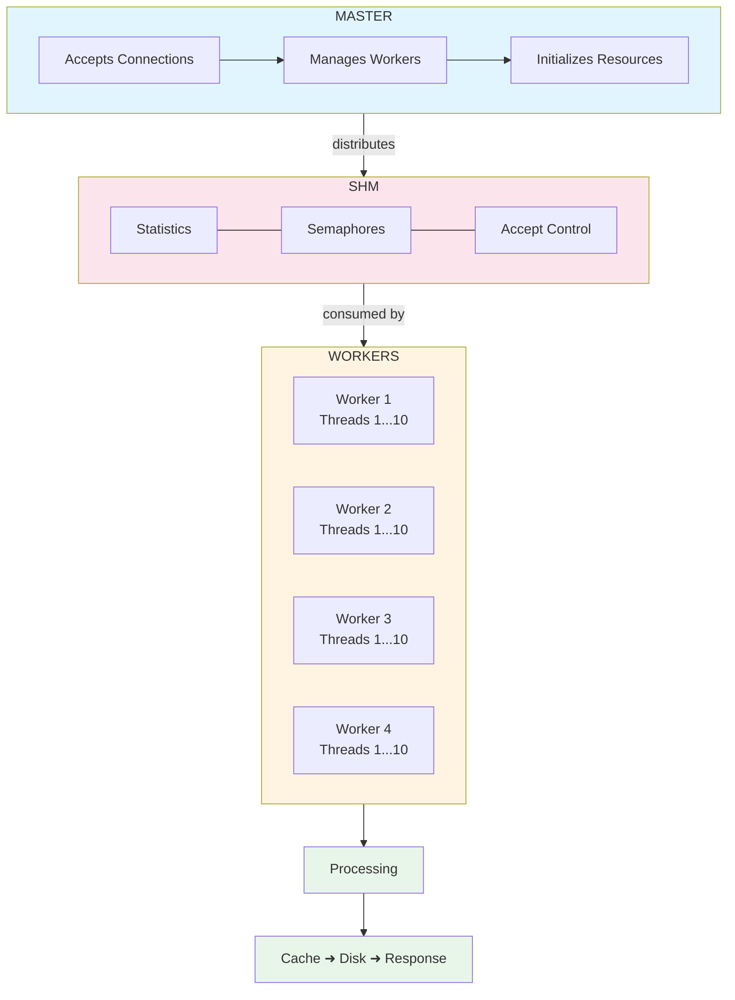

```mermaid
graph TD
    MASTER["Master Process"] -->|distributes| SHM
    SHM -->|consumed by| WORKERS
    WORKERS --> PROC[Processing] --> RES[Cache ➜ Disk ➜ Response]

    subgraph MASTER
        M1[Accepts Connections] --> M2[Manages Workers] --> M3[Initializes Resources]
    end
    
    subgraph SHM
        SHM1[Statistics] --- SHM2[Semaphores] --- SHM3[Accept Control]
    end
    
    subgraph WORKERS
        W1["Worker 1<br/>Threads 1...10"]
        W2["Worker 2<br/>Threads 1...10"]
        W3["Worker 3<br/>Threads 1...10"]
        W4["Worker 4<br/>Threads 1...10"]
    end

    style MASTER fill:#e1f5ff
    style SHM fill:#fce4ec
    style WORKERS fill:#fff4e1
    style PROC fill:#e8f5e9
    style RES fill:#e8f5e9
```